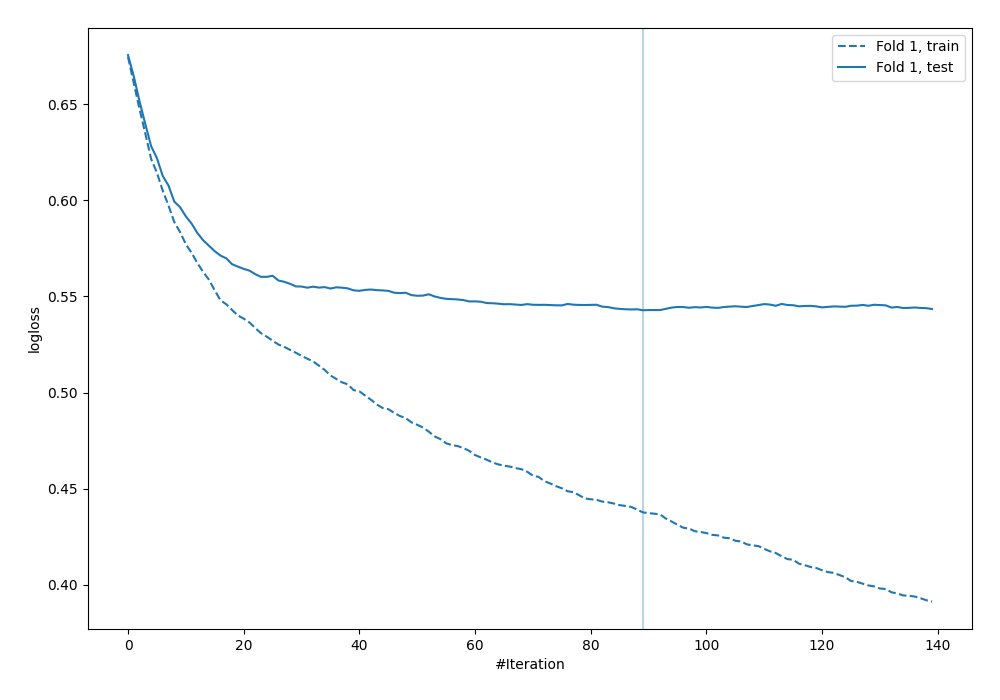

# Summary of 30_CatBoost

[<< Go back](../README.md)

## CatBoost
- **n_jobs**: -1
- **learning_rate**: 0.05
- **depth**: 8
- **rsm**: 0.8
- **loss_function**: Logloss
- **explain_level**: 0

## Validation
 - **validation_type**: split
 - **train_ratio**: 0.9
 - **shuffle**: True
 - **stratify**: True

## Optimized metric
logloss

## Training time

3.6 seconds

## Metric details
|           |    score |    threshold |
|:----------|---------:|-------------:|
| logloss   | 0.542842 | nan          |
| auc       | 0.68979  | nan          |
| f1        | 0.557103 |   0.240388   |
| accuracy  | 0.701149 |   0.544981   |
| precision | 0.533333 |   0.544981   |
| recall    | 1        |   0.00604825 |
| mcc       | 0.329391 |   0.240388   |

## Confusion matrix (at threshold=0.544981)
|                     |   Predicted as negative |   Predicted as positive |
|:--------------------|------------------------:|------------------------:|
| Labeled as negative |                     236 |                       7 |
| Labeled as positive |                      97 |                       8 |

## Learning curves

[<< Go back](../README.md)
