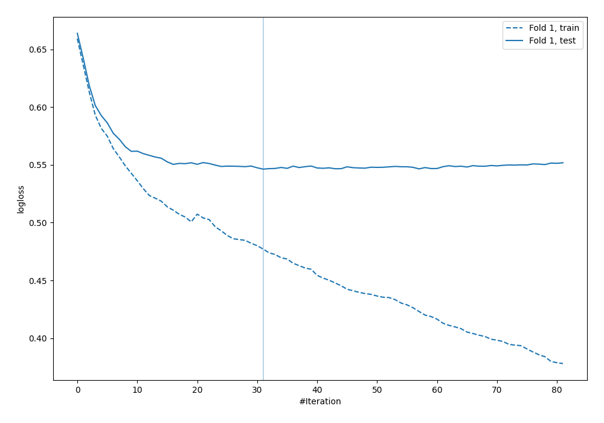

# Summary of 31_CatBoost

[<< Go back](../README.md)

## CatBoost
- **n_jobs**: -1
- **learning_rate**: 0.1
- **depth**: 8
- **rsm**: 1.0
- **loss_function**: Logloss
- **explain_level**: 0

## Validation
 - **validation_type**: split
 - **train_ratio**: 0.9
 - **shuffle**: True
 - **stratify**: True

## Optimized metric
logloss

## Training time

2.5 seconds

## Metric details
|           |    score |   threshold |
|:----------|---------:|------------:|
| logloss   | 0.546391 |  nan        |
| auc       | 0.684421 |  nan        |
| f1        | 0.550409 |    0.227914 |
| accuracy  | 0.704023 |    0.513926 |
| precision | 0.555556 |    0.513926 |
| recall    | 1        |    0.015716 |
| mcc       | 0.318553 |    0.227914 |

## Confusion matrix (at threshold=0.513926)
|                     |   Predicted as negative |   Predicted as positive |
|:--------------------|------------------------:|------------------------:|
| Labeled as negative |                     235 |                       8 |
| Labeled as positive |                      95 |                      10 |

## Learning curves

[<< Go back](../README.md)
