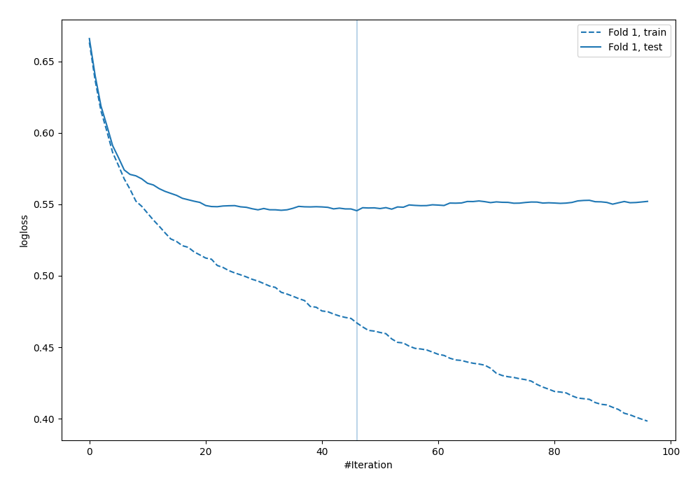

# Summary of 32_CatBoost

[<< Go back](../README.md)

## CatBoost
- **n_jobs**: -1
- **learning_rate**: 0.1
- **depth**: 7
- **rsm**: 1.0
- **loss_function**: Logloss
- **explain_level**: 0

## Validation
 - **validation_type**: split
 - **train_ratio**: 0.9
 - **shuffle**: True
 - **stratify**: True

## Optimized metric
logloss

## Training time

2.0 seconds

## Metric details
|           |    score |   threshold |
|:----------|---------:|------------:|
| logloss   | 0.545522 | nan         |
| auc       | 0.685087 | nan         |
| f1        | 0.554348 |   0.22781   |
| accuracy  | 0.701149 |   0.548491  |
| precision | 0.533333 |   0.548491  |
| recall    | 1        |   0.0079525 |
| mcc       | 0.329987 |   0.22781   |

## Confusion matrix (at threshold=0.548491)
|                     |   Predicted as negative |   Predicted as positive |
|:--------------------|------------------------:|------------------------:|
| Labeled as negative |                     236 |                       7 |
| Labeled as positive |                      97 |                       8 |

## Learning curves

[<< Go back](../README.md)
