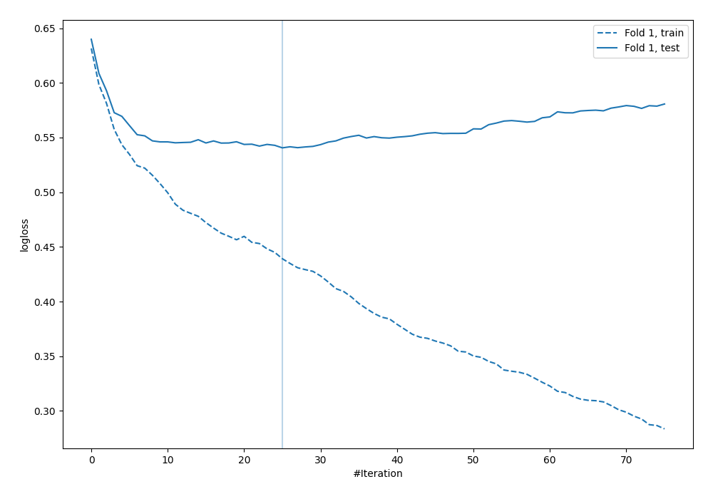

# Summary of 33_CatBoost

[<< Go back](../README.md)

## CatBoost
- **n_jobs**: -1
- **learning_rate**: 0.2
- **depth**: 8
- **rsm**: 1.0
- **loss_function**: Logloss
- **explain_level**: 0

## Validation
 - **validation_type**: split
 - **train_ratio**: 0.9
 - **shuffle**: True
 - **stratify**: True

## Optimized metric
logloss

## Training time

2.7 seconds

## Metric details
|           |    score |    threshold |
|:----------|---------:|-------------:|
| logloss   | 0.540582 | nan          |
| auc       | 0.697394 | nan          |
| f1        | 0.573134 |   0.255753   |
| accuracy  | 0.706897 |   0.573506   |
| precision | 0.588235 |   0.573506   |
| recall    | 1        |   0.00998106 |
| mcc       | 0.351815 |   0.255753   |

## Confusion matrix (at threshold=0.573506)
|                     |   Predicted as negative |   Predicted as positive |
|:--------------------|------------------------:|------------------------:|
| Labeled as negative |                     236 |                       7 |
| Labeled as positive |                      95 |                      10 |

## Learning curves

[<< Go back](../README.md)
