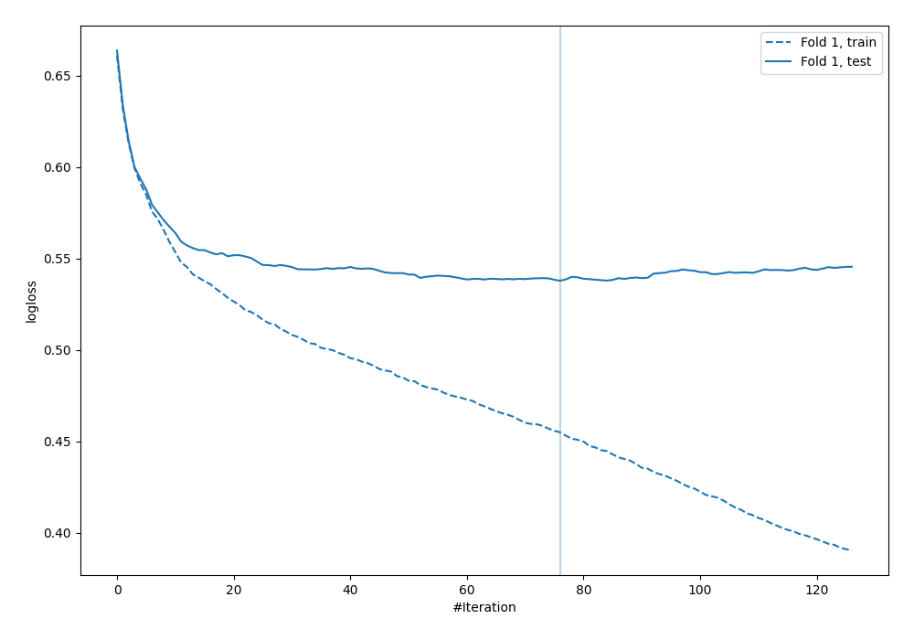

# Summary of 34_CatBoost

[<< Go back](../README.md)

## CatBoost
- **n_jobs**: -1
- **learning_rate**: 0.1
- **depth**: 6
- **rsm**: 0.7
- **loss_function**: Logloss
- **explain_level**: 0

## Validation
 - **validation_type**: split
 - **train_ratio**: 0.9
 - **shuffle**: True
 - **stratify**: True

## Optimized metric
logloss

## Training time

1.9 seconds

## Metric details
|           |    score |    threshold |
|:----------|---------:|-------------:|
| logloss   | 0.537923 | nan          |
| auc       | 0.705036 | nan          |
| f1        | 0.567901 |   0.27484    |
| accuracy  | 0.698276 |   0.469033   |
| precision | 0.5      |   0.469033   |
| recall    | 1        |   0.00502515 |
| mcc       | 0.336001 |   0.27484    |

## Confusion matrix (at threshold=0.469033)
|                     |   Predicted as negative |   Predicted as positive |
|:--------------------|------------------------:|------------------------:|
| Labeled as negative |                     216 |                      27 |
| Labeled as positive |                      78 |                      27 |

## Learning curves

[<< Go back](../README.md)
