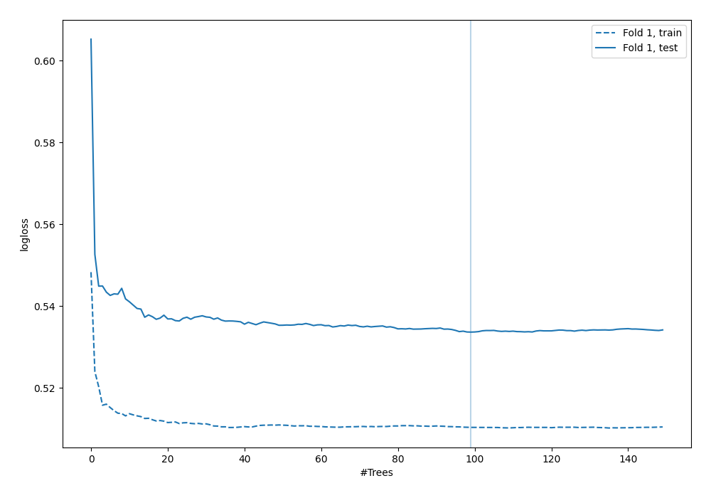

# Summary of 39_RandomForest

[<< Go back](../README.md)

## Random Forest
- **n_jobs**: -1
- **criterion**: gini
- **max_features**: 0.5
- **min_samples_split**: 20
- **max_depth**: 4
- **explain_level**: 0

## Validation
 - **validation_type**: split
 - **train_ratio**: 0.9
 - **shuffle**: True
 - **stratify**: True

## Optimized metric
logloss

## Training time

2.8 seconds

## Metric details
|           |    score |   threshold |
|:----------|---------:|------------:|
| logloss   | 0.533646 | nan         |
| auc       | 0.702567 | nan         |
| f1        | 0.554622 |   0.281595  |
| accuracy  | 0.715517 |   0.478051  |
| precision | 0.607143 |   0.478051  |
| recall    | 1        |   0.0109022 |
| mcc       | 0.323942 |   0.233816  |

## Confusion matrix (at threshold=0.478051)
|                     |   Predicted as negative |   Predicted as positive |
|:--------------------|------------------------:|------------------------:|
| Labeled as negative |                     232 |                      11 |
| Labeled as positive |                      88 |                      17 |

## Learning curves

[<< Go back](../README.md)
