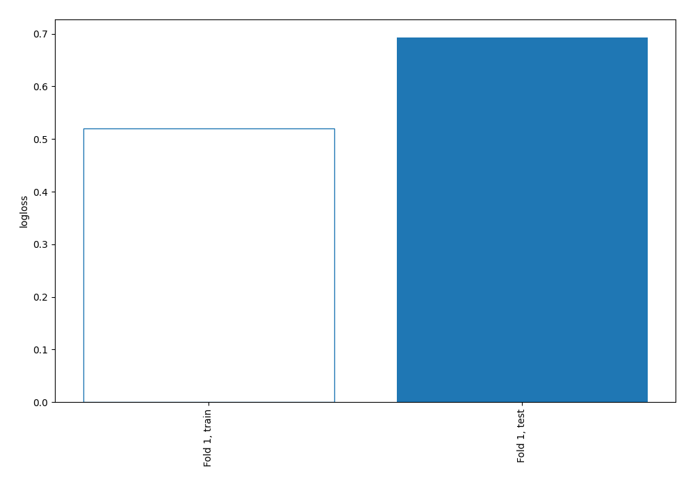

# Summary of 3_DecisionTree_GoldenFeatures

[<< Go back](../README.md)

## Decision Tree
- **n_jobs**: -1
- **criterion**: gini
- **max_depth**: 4
- **explain_level**: 0

## Validation
 - **validation_type**: split
 - **train_ratio**: 0.9
 - **shuffle**: True
 - **stratify**: True

## Optimized metric
logloss

## Training time

10.0 seconds

## Metric details
|           |    score |    threshold |
|:----------|---------:|-------------:|
| logloss   | 0.692935 | nan          |
| auc       | 0.666882 | nan          |
| f1        | 0.548303 |   0.191491   |
| accuracy  | 0.686782 |   0.527027   |
| precision | 0.40625  |   0.276632   |
| recall    | 1        |   0.00511364 |
| mcc       | 0.329851 |   0.191491   |

## Confusion matrix (at threshold=0.527027)
|                     |   Predicted as negative |   Predicted as positive |
|:--------------------|------------------------:|------------------------:|
| Labeled as negative |                     239 |                       4 |
| Labeled as positive |                     105 |                       0 |

## Learning curves

[<< Go back](../README.md)
