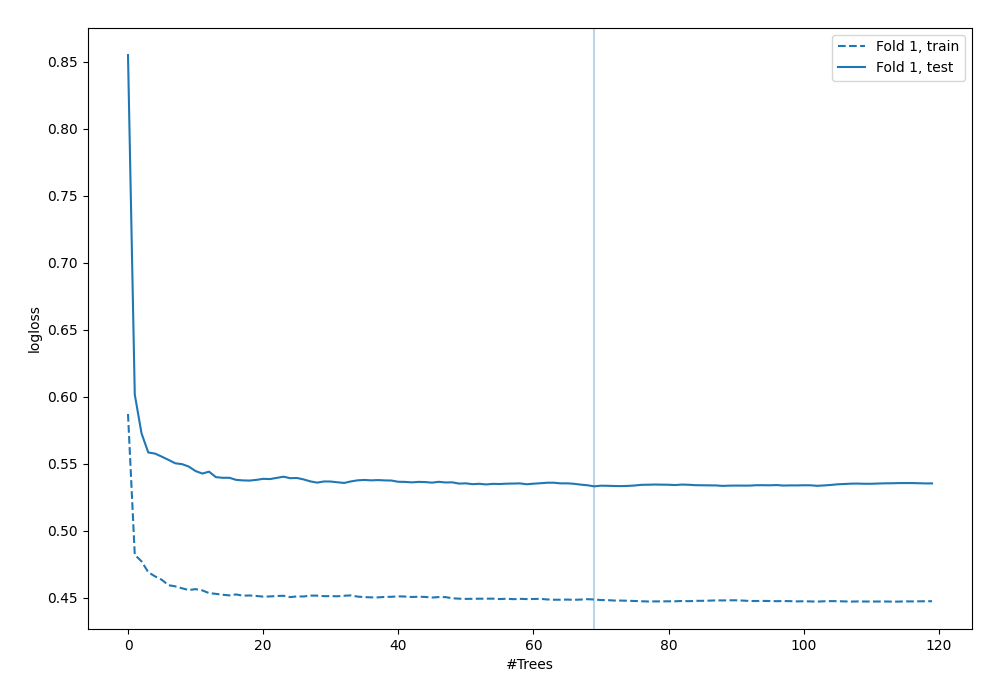

# Summary of 40_RandomForest

[<< Go back](../README.md)

## Random Forest
- **n_jobs**: -1
- **criterion**: gini
- **max_features**: 0.7
- **min_samples_split**: 30
- **max_depth**: 7
- **explain_level**: 0

## Validation
 - **validation_type**: split
 - **train_ratio**: 0.9
 - **shuffle**: True
 - **stratify**: True

## Optimized metric
logloss

## Training time

3.7 seconds

## Metric details
|           |    score |    threshold |
|:----------|---------:|-------------:|
| logloss   | 0.533113 | nan          |
| auc       | 0.705467 | nan          |
| f1        | 0.554878 |   0.29637    |
| accuracy  | 0.718391 |   0.530965   |
| precision | 0.62963  |   0.530965   |
| recall    | 1        |   0.00190336 |
| mcc       | 0.321678 |   0.25968    |

## Confusion matrix (at threshold=0.530965)
|                     |   Predicted as negative |   Predicted as positive |
|:--------------------|------------------------:|------------------------:|
| Labeled as negative |                     233 |                      10 |
| Labeled as positive |                      88 |                      17 |

## Learning curves

[<< Go back](../README.md)
