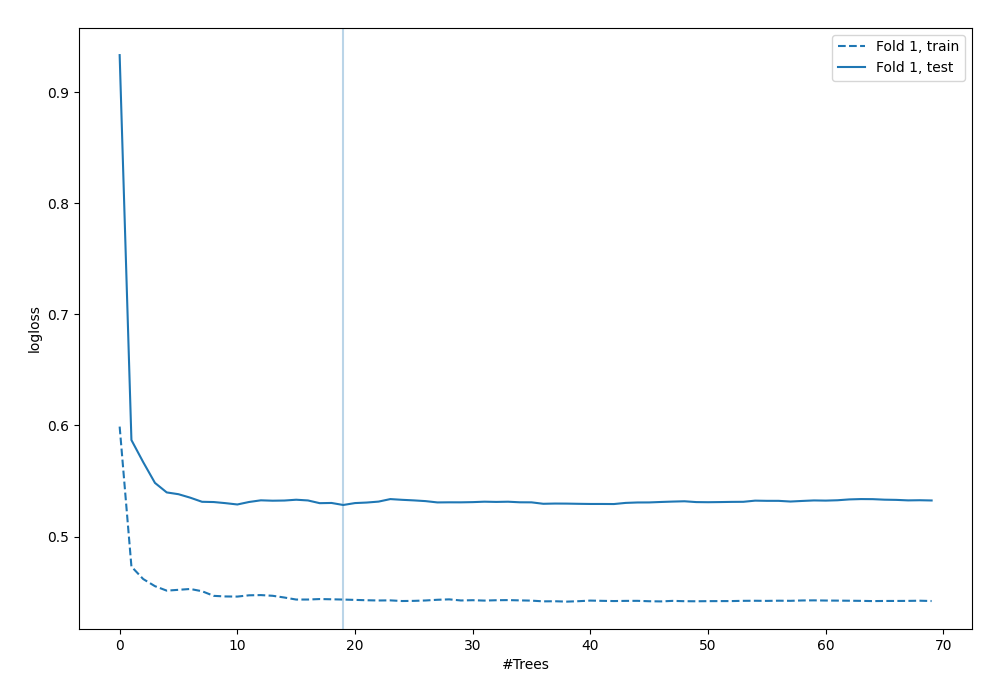

# Summary of 40_RandomForest_KMeansFeatures

[<< Go back](../README.md)

## Random Forest
- **n_jobs**: -1
- **criterion**: gini
- **max_features**: 0.7
- **min_samples_split**: 30
- **max_depth**: 7
- **explain_level**: 0

## Validation
 - **validation_type**: split
 - **train_ratio**: 0.9
 - **shuffle**: True
 - **stratify**: True

## Optimized metric
logloss

## Training time

3.7 seconds

## Metric details
|           |    score |    threshold |
|:----------|---------:|-------------:|
| logloss   | 0.528389 | nan          |
| auc       | 0.717225 | nan          |
| f1        | 0.565789 |   0.318462   |
| accuracy  | 0.706897 |   0.547425   |
| precision | 0.588235 |   0.547425   |
| recall    | 1        |   0.00550492 |
| mcc       | 0.330212 |   0.257227   |

## Confusion matrix (at threshold=0.547425)
|                     |   Predicted as negative |   Predicted as positive |
|:--------------------|------------------------:|------------------------:|
| Labeled as negative |                     236 |                       7 |
| Labeled as positive |                      95 |                      10 |

## Learning curves

[<< Go back](../README.md)
