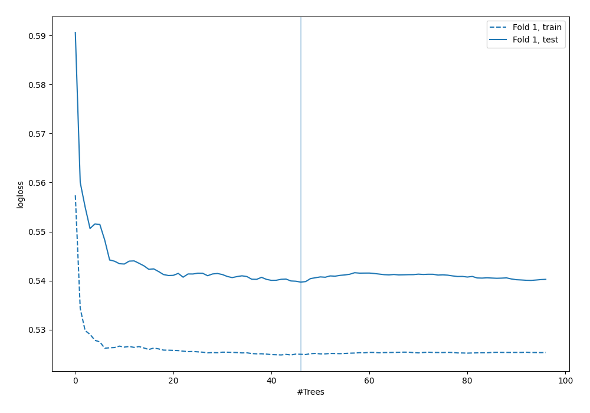

# Summary of 41_RandomForest

[<< Go back](../README.md)

## Random Forest
- **n_jobs**: -1
- **criterion**: gini
- **max_features**: 0.8
- **min_samples_split**: 40
- **max_depth**: 3
- **explain_level**: 0

## Validation
 - **validation_type**: split
 - **train_ratio**: 0.9
 - **shuffle**: True
 - **stratify**: True

## Optimized metric
logloss

## Training time

1.9 seconds

## Metric details
|           |    score |   threshold |
|:----------|---------:|------------:|
| logloss   | 0.539692 | nan         |
| auc       | 0.684205 | nan         |
| f1        | 0.553672 |   0.283599  |
| accuracy  | 0.704023 |   0.469771  |
| precision | 0.533333 |   0.469771  |
| recall    | 1        |   0.0211643 |
| mcc       | 0.332798 |   0.237466  |

## Confusion matrix (at threshold=0.469771)
|                     |   Predicted as negative |   Predicted as positive |
|:--------------------|------------------------:|------------------------:|
| Labeled as negative |                     229 |                      14 |
| Labeled as positive |                      89 |                      16 |

## Learning curves

[<< Go back](../README.md)
