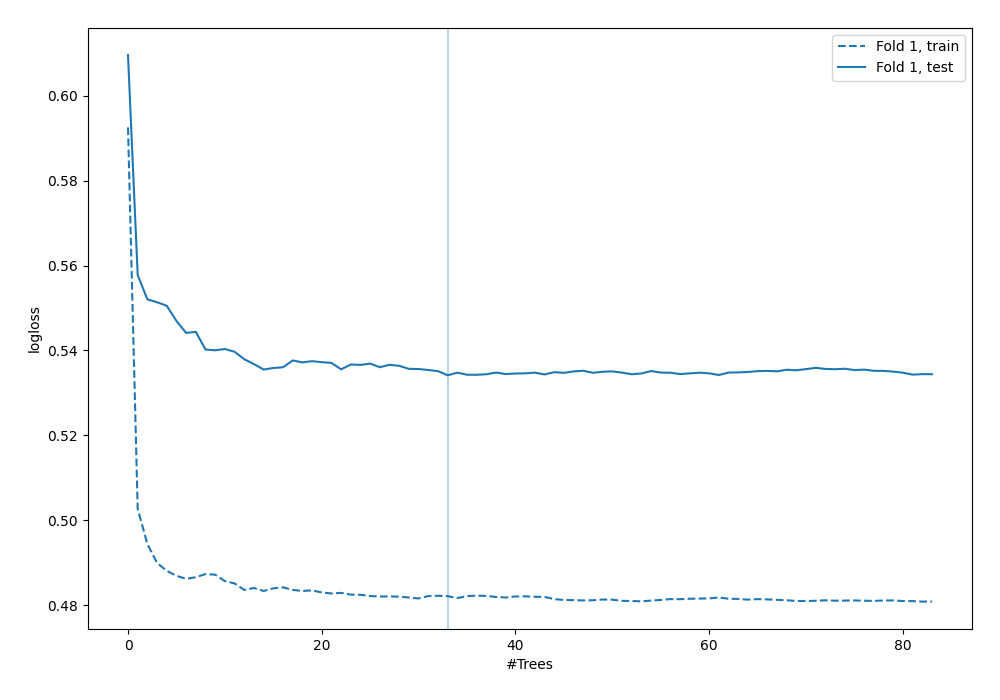

# Summary of 42_RandomForest

[<< Go back](../README.md)

## Random Forest
- **n_jobs**: -1
- **criterion**: entropy
- **max_features**: 0.6
- **min_samples_split**: 50
- **max_depth**: 6
- **explain_level**: 0

## Validation
 - **validation_type**: split
 - **train_ratio**: 0.9
 - **shuffle**: True
 - **stratify**: True

## Optimized metric
logloss

## Training time

2.4 seconds

## Metric details
|           |    score |   threshold |
|:----------|---------:|------------:|
| logloss   | 0.534153 |  nan        |
| auc       | 0.700412 |  nan        |
| f1        | 0.555256 |    0.231049 |
| accuracy  | 0.706897 |    0.496982 |
| precision | 0.55     |    0.528818 |
| recall    | 1        |    0        |
| mcc       | 0.335468 |    0.231049 |

## Confusion matrix (at threshold=0.496982)
|                     |   Predicted as negative |   Predicted as positive |
|:--------------------|------------------------:|------------------------:|
| Labeled as negative |                     227 |                      16 |
| Labeled as positive |                      86 |                      19 |

## Learning curves

[<< Go back](../README.md)
