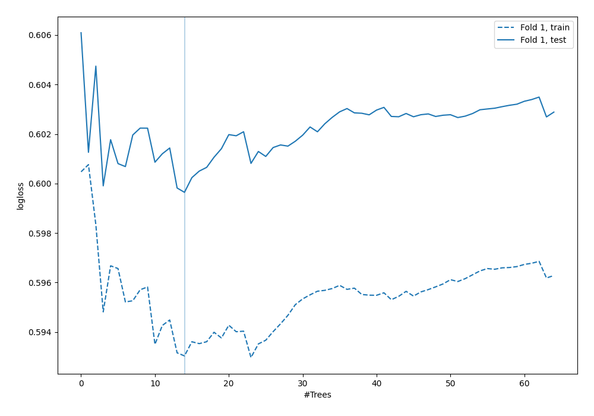

# Summary of 48_ExtraTrees

[<< Go back](../README.md)

## Extra Trees Classifier (Extra Trees)
- **n_jobs**: -1
- **criterion**: gini
- **max_features**: 0.5
- **min_samples_split**: 20
- **max_depth**: 4
- **explain_level**: 0

## Validation
 - **validation_type**: split
 - **train_ratio**: 0.9
 - **shuffle**: True
 - **stratify**: True

## Optimized metric
logloss

## Training time

1.1 seconds

## Metric details
|           |    score |   threshold |
|:----------|---------:|------------:|
| logloss   | 0.599645 |  nan        |
| auc       | 0.623888 |  nan        |
| f1        | 0.509485 |    0.284352 |
| accuracy  | 0.698276 |    0.333537 |
| precision | 0.5      |    0.333537 |
| recall    | 1        |    0.10852  |
| mcc       | 0.209863 |    0.284352 |

## Confusion matrix (at threshold=0.333537)
|                     |   Predicted as negative |   Predicted as positive |
|:--------------------|------------------------:|------------------------:|
| Labeled as negative |                     225 |                      18 |
| Labeled as positive |                      87 |                      18 |

## Learning curves

[<< Go back](../README.md)
