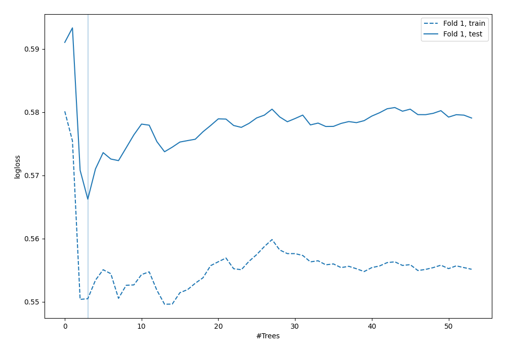

# Summary of 49_ExtraTrees

[<< Go back](../README.md)

## Extra Trees Classifier (Extra Trees)
- **n_jobs**: -1
- **criterion**: gini
- **max_features**: 0.7
- **min_samples_split**: 30
- **max_depth**: 7
- **explain_level**: 0

## Validation
 - **validation_type**: split
 - **train_ratio**: 0.9
 - **shuffle**: True
 - **stratify**: True

## Optimized metric
logloss

## Training time

1.1 seconds

## Metric details
|           |    score |   threshold |
|:----------|---------:|------------:|
| logloss   | 0.566237 | nan         |
| auc       | 0.695356 | nan         |
| f1        | 0.545455 |   0.272352  |
| accuracy  | 0.727011 |   0.380673  |
| precision | 0.727273 |   0.41237   |
| recall    | 1        |   0.0105403 |
| mcc       | 0.304039 |   0.26536   |

## Confusion matrix (at threshold=0.380673)
|                     |   Predicted as negative |   Predicted as positive |
|:--------------------|------------------------:|------------------------:|
| Labeled as negative |                     231 |                      12 |
| Labeled as positive |                      83 |                      22 |

## Learning curves

[<< Go back](../README.md)
