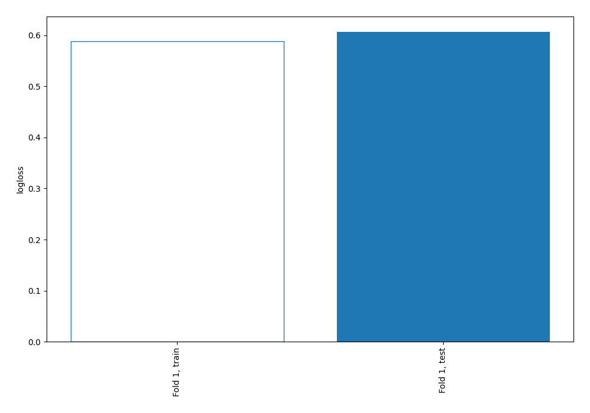

# Summary of 4_Linear

[<< Go back](../README.md)

## Logistic Regression (Linear)
- **n_jobs**: -1
- **explain_level**: 0

## Validation
 - **validation_type**: split
 - **train_ratio**: 0.9
 - **shuffle**: True
 - **stratify**: True

## Optimized metric
logloss

## Training time

3.1 seconds

## Metric details
|           |    score |     threshold |
|:----------|---------:|--------------:|
| logloss   | 0.60657  | nan           |
| auc       | 0.576876 | nan           |
| f1        | 0.478261 |   0.264155    |
| accuracy  | 0.701149 |   0.40563     |
| precision | 0.526316 |   0.40563     |
| recall    | 1        |   2.03681e-36 |
| mcc       | 0.143385 |   0.29571     |

## Confusion matrix (at threshold=0.40563)
|                     |   Predicted as negative |   Predicted as positive |
|:--------------------|------------------------:|------------------------:|
| Labeled as negative |                     234 |                       9 |
| Labeled as positive |                      95 |                      10 |

## Learning curves

[<< Go back](../README.md)
