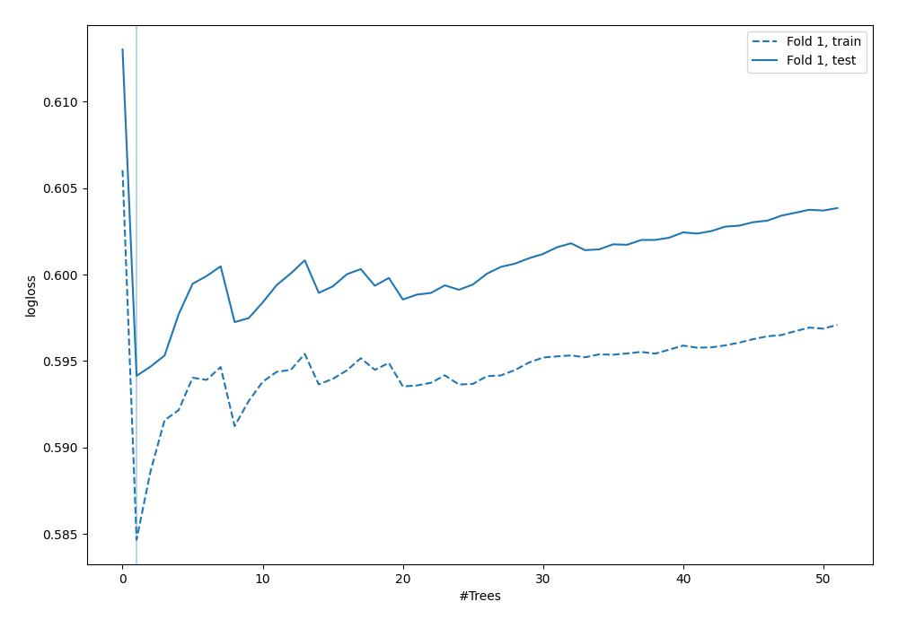

# Summary of 50_ExtraTrees

[<< Go back](../README.md)

## Extra Trees Classifier (Extra Trees)
- **n_jobs**: -1
- **criterion**: gini
- **max_features**: 0.8
- **min_samples_split**: 40
- **max_depth**: 3
- **explain_level**: 0

## Validation
 - **validation_type**: split
 - **train_ratio**: 0.9
 - **shuffle**: True
 - **stratify**: True

## Optimized metric
logloss

## Training time

1.0 seconds

## Metric details
|           |    score |   threshold |
|:----------|---------:|------------:|
| logloss   | 0.594151 |  nan        |
| auc       | 0.621869 |  nan        |
| f1        | 0.510511 |    0.244642 |
| accuracy  | 0.692529 |    0.446778 |
| precision | 0.393443 |    0.304898 |
| recall    | 1        |    0.174803 |
| mcc       | 0.213463 |    0.244642 |

## Confusion matrix (at threshold=0.446778)
|                     |   Predicted as negative |   Predicted as positive |
|:--------------------|------------------------:|------------------------:|
| Labeled as negative |                     241 |                       2 |
| Labeled as positive |                     105 |                       0 |

## Learning curves

[<< Go back](../README.md)
