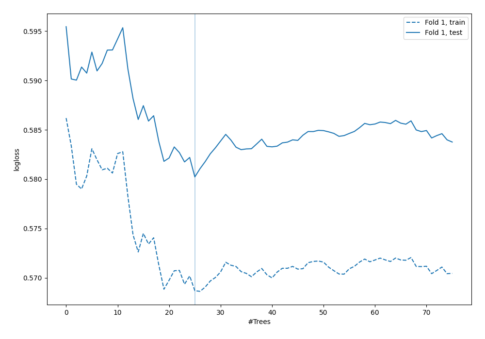

# Summary of 51_ExtraTrees

[<< Go back](../README.md)

## Extra Trees Classifier (Extra Trees)
- **n_jobs**: -1
- **criterion**: entropy
- **max_features**: 0.6
- **min_samples_split**: 50
- **max_depth**: 6
- **explain_level**: 0

## Validation
 - **validation_type**: split
 - **train_ratio**: 0.9
 - **shuffle**: True
 - **stratify**: True

## Optimized metric
logloss

## Training time

1.4 seconds

## Metric details
|           |    score |   threshold |
|:----------|---------:|------------:|
| logloss   | 0.580226 |  nan        |
| auc       | 0.685283 |  nan        |
| f1        | 0.553763 |    0.27217  |
| accuracy  | 0.689655 |    0.397904 |
| precision | 0.450549 |    0.337959 |
| recall    | 1        |    0.036081 |
| mcc       | 0.332798 |    0.256514 |

## Confusion matrix (at threshold=0.397904)
|                     |   Predicted as negative |   Predicted as positive |
|:--------------------|------------------------:|------------------------:|
| Labeled as negative |                     233 |                      10 |
| Labeled as positive |                      98 |                       7 |

## Learning curves

[<< Go back](../README.md)
