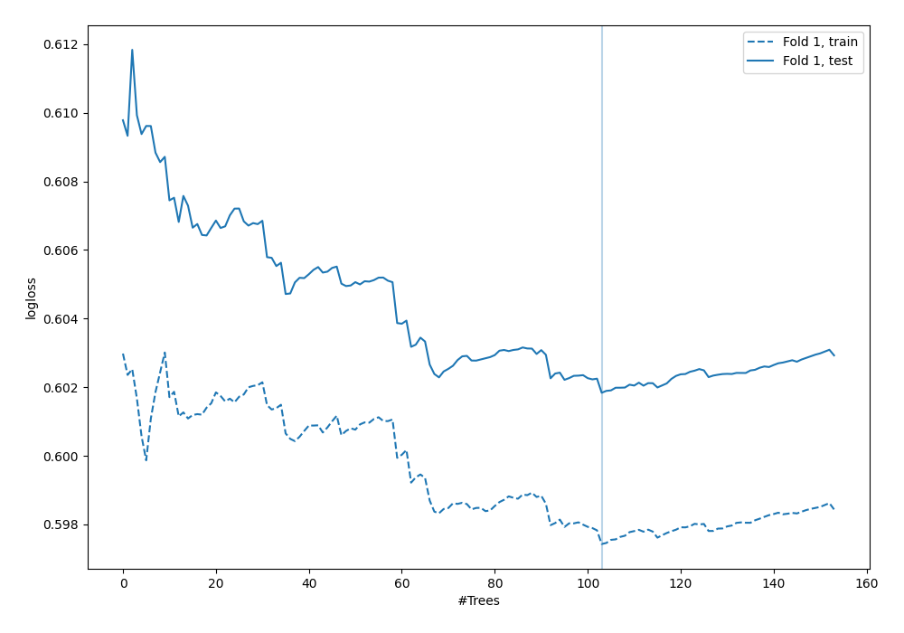

# Summary of 52_ExtraTrees

[<< Go back](../README.md)

## Extra Trees Classifier (Extra Trees)
- **n_jobs**: -1
- **criterion**: gini
- **max_features**: 0.7
- **min_samples_split**: 50
- **max_depth**: 3
- **explain_level**: 0

## Validation
 - **validation_type**: split
 - **train_ratio**: 0.9
 - **shuffle**: True
 - **stratify**: True

## Optimized metric
logloss

## Training time

1.9 seconds

## Metric details
|           |    score |   threshold |
|:----------|---------:|------------:|
| logloss   | 0.601839 |  nan        |
| auc       | 0.634039 |  nan        |
| f1        | 0.522581 |    0.300257 |
| accuracy  | 0.704023 |    0.332963 |
| precision | 0.529412 |    0.332963 |
| recall    | 1        |    0.147735 |
| mcc       | 0.243628 |    0.300257 |

## Confusion matrix (at threshold=0.332963)
|                     |   Predicted as negative |   Predicted as positive |
|:--------------------|------------------------:|------------------------:|
| Labeled as negative |                     227 |                      16 |
| Labeled as positive |                      87 |                      18 |

## Learning curves

[<< Go back](../README.md)
