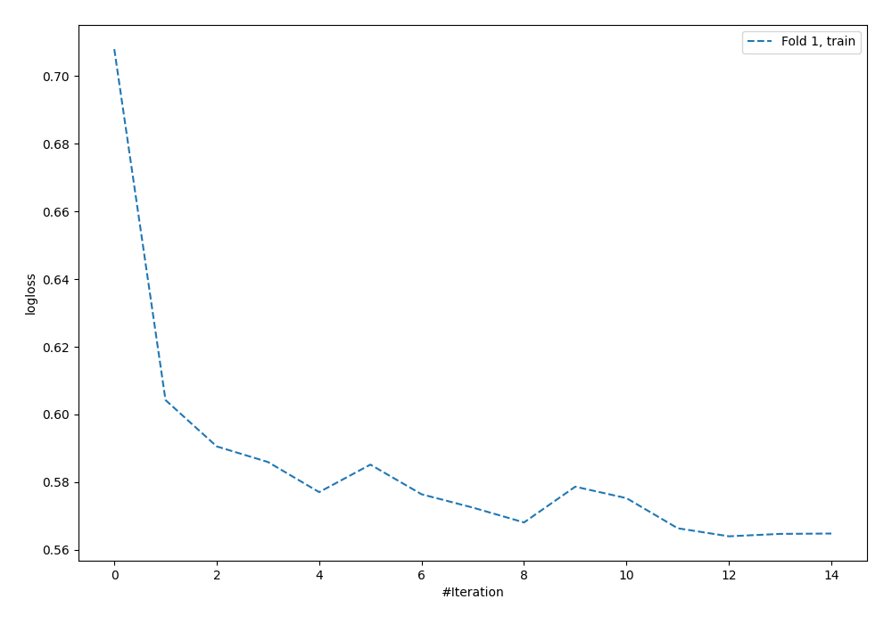

# Summary of 57_NeuralNetwork

[<< Go back](../README.md)

## Neural Network
- **n_jobs**: -1
- **dense_1_size**: 32
- **dense_2_size**: 4
- **learning_rate**: 0.05
- **explain_level**: 0

## Validation
 - **validation_type**: split
 - **train_ratio**: 0.9
 - **shuffle**: True
 - **stratify**: True

## Optimized metric
logloss

## Training time

1.0 seconds

## Metric details
|           |    score |     threshold |
|:----------|---------:|--------------:|
| logloss   | 0.594065 | nan           |
| auc       | 0.620478 | nan           |
| f1        | 0.5      |   0.259719    |
| accuracy  | 0.689655 |   0.483741    |
| precision | 0.448276 |   0.375757    |
| recall    | 1        |   8.27641e-13 |
| mcc       | 0.203874 |   0.259719    |

## Confusion matrix (at threshold=0.483741)
|                     |   Predicted as negative |   Predicted as positive |
|:--------------------|------------------------:|------------------------:|
| Labeled as negative |                     231 |                      12 |
| Labeled as positive |                      96 |                       9 |

## Learning curves

[<< Go back](../README.md)
