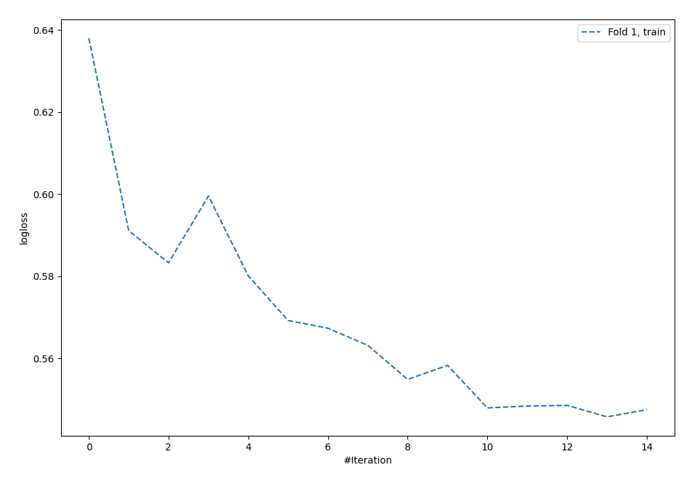

# Summary of 58_NeuralNetwork

[<< Go back](../README.md)

## Neural Network
- **n_jobs**: -1
- **dense_1_size**: 64
- **dense_2_size**: 16
- **learning_rate**: 0.01
- **explain_level**: 0

## Validation
 - **validation_type**: split
 - **train_ratio**: 0.9
 - **shuffle**: True
 - **stratify**: True

## Optimized metric
logloss

## Training time

1.1 seconds

## Metric details
|           |    score |     threshold |
|:----------|---------:|--------------:|
| logloss   | 0.594152 | nan           |
| auc       | 0.605644 | nan           |
| f1        | 0.494898 |   0.175923    |
| accuracy  | 0.706897 |   0.491847    |
| precision | 1        |   0.603136    |
| recall    | 1        |   7.16558e-10 |
| mcc       | 0.176557 |   0.253607    |

## Confusion matrix (at threshold=0.491847)
|                     |   Predicted as negative |   Predicted as positive |
|:--------------------|------------------------:|------------------------:|
| Labeled as negative |                     235 |                       8 |
| Labeled as positive |                      94 |                      11 |

## Learning curves

[<< Go back](../README.md)
