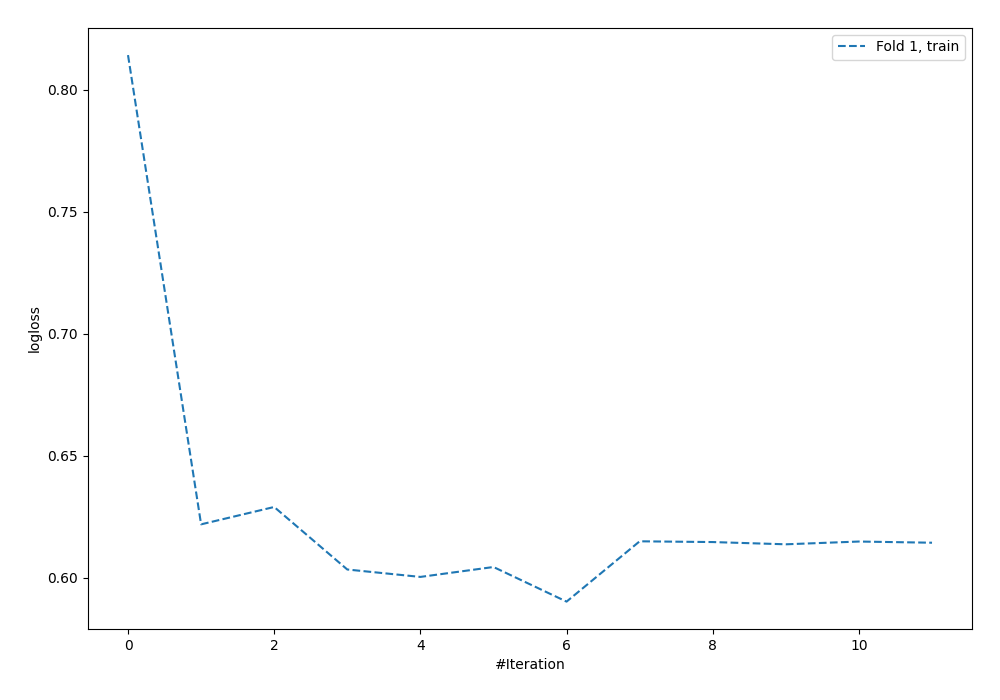

# Summary of 59_NeuralNetwork

[<< Go back](../README.md)

## Neural Network
- **n_jobs**: -1
- **dense_1_size**: 64
- **dense_2_size**: 32
- **learning_rate**: 0.08
- **explain_level**: 0

## Validation
 - **validation_type**: split
 - **train_ratio**: 0.9
 - **shuffle**: True
 - **stratify**: True

## Optimized metric
logloss

## Training time

0.7 seconds

## Metric details
|           |     score |   threshold |
|:----------|----------:|------------:|
| logloss   | 0.621737  |  nan        |
| auc       | 0.5068    |  nan        |
| f1        | 0.470588  |    0.212952 |
| accuracy  | 0.637931  |    0.40043  |
| precision | 0.327586  |    0.292932 |
| recall    | 1         |    0.048159 |
| mcc       | 0.0829783 |    0.212952 |

## Confusion matrix (at threshold=0.40043)
|                     |   Predicted as negative |   Predicted as positive |
|:--------------------|------------------------:|------------------------:|
| Labeled as negative |                     215 |                      28 |
| Labeled as positive |                      98 |                       7 |

## Learning curves

[<< Go back](../README.md)
