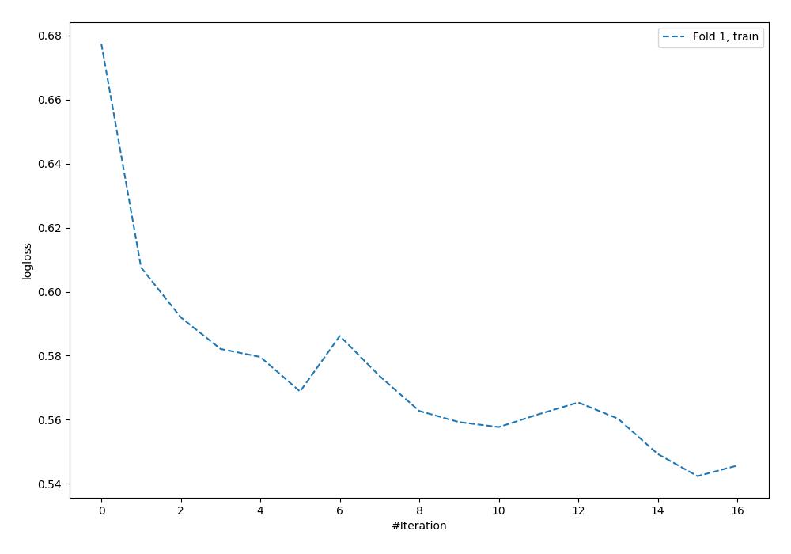

# Summary of 60_NeuralNetwork

[<< Go back](../README.md)

## Neural Network
- **n_jobs**: -1
- **dense_1_size**: 32
- **dense_2_size**: 32
- **learning_rate**: 0.05
- **explain_level**: 0

## Validation
 - **validation_type**: split
 - **train_ratio**: 0.9
 - **shuffle**: True
 - **stratify**: True

## Optimized metric
logloss

## Training time

1.1 seconds

## Metric details
|           |    score |     threshold |
|:----------|---------:|--------------:|
| logloss   | 0.5734   | nan           |
| auc       | 0.646365 | nan           |
| f1        | 0.524691 |   0.325446    |
| accuracy  | 0.701149 |   0.553277    |
| precision | 0.6      |   0.553277    |
| recall    | 1        |   2.76896e-33 |
| mcc       | 0.253324 |   0.173192    |

## Confusion matrix (at threshold=0.553277)
|                     |   Predicted as negative |   Predicted as positive |
|:--------------------|------------------------:|------------------------:|
| Labeled as negative |                     241 |                       2 |
| Labeled as positive |                     102 |                       3 |

## Learning curves

[<< Go back](../README.md)
