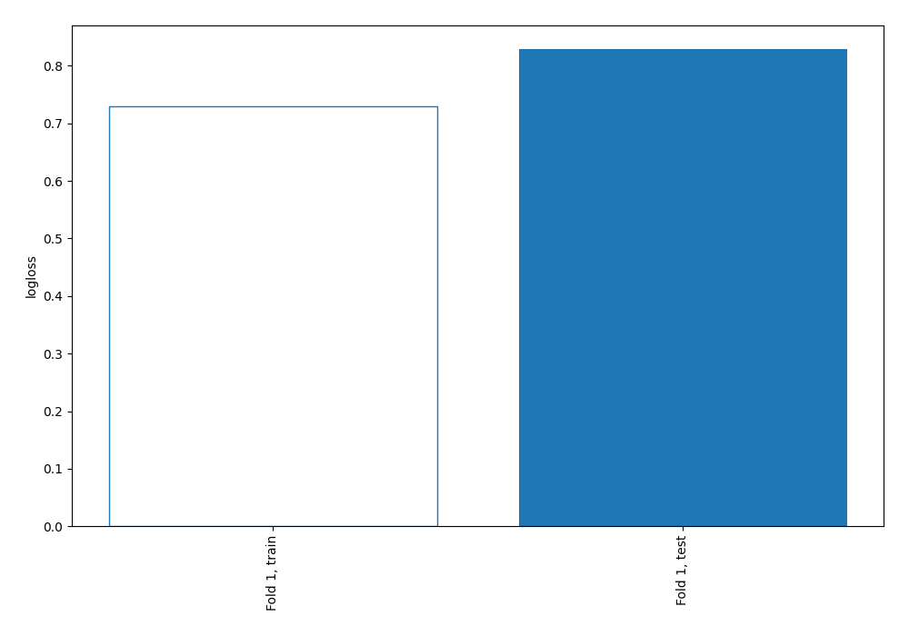

# Summary of 66_NearestNeighbors

[<< Go back](../README.md)

## k-Nearest Neighbors (Nearest Neighbors)
- **n_jobs**: -1
- **n_neighbors**: 7
- **weights**: uniform
- **explain_level**: 0

## Validation
 - **validation_type**: split
 - **train_ratio**: 0.9
 - **shuffle**: True
 - **stratify**: True

## Optimized metric
logloss

## Training time

0.8 seconds

## Metric details
|           |    score |   threshold |
|:----------|---------:|------------:|
| logloss   | 0.82899  |  nan        |
| auc       | 0.589242 |  nan        |
| f1        | 0.490099 |    0        |
| accuracy  | 0.698276 |    0.571429 |
| precision | 0.5      |    0.571429 |
| recall    | 0.942857 |    0        |
| mcc       | 0.158112 |    0        |

## Confusion matrix (at threshold=0.571429)
|                     |   Predicted as negative |   Predicted as positive |
|:--------------------|------------------------:|------------------------:|
| Labeled as negative |                     232 |                      11 |
| Labeled as positive |                      94 |                      11 |

## Learning curves

[<< Go back](../README.md)
