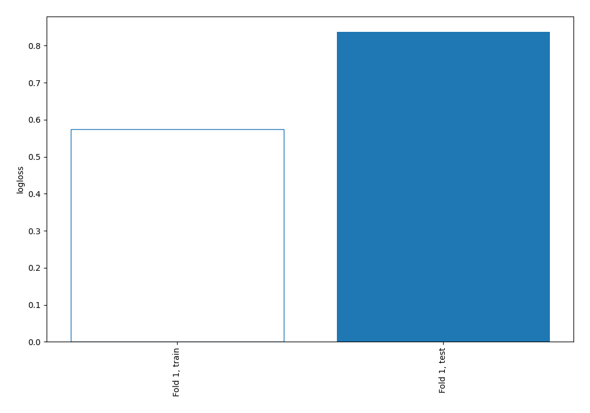

# Summary of 67_NearestNeighbors

[<< Go back](../README.md)

## k-Nearest Neighbors (Nearest Neighbors)
- **n_jobs**: -1
- **n_neighbors**: 7
- **weights**: distance
- **explain_level**: 0

## Validation
 - **validation_type**: split
 - **train_ratio**: 0.9
 - **shuffle**: True
 - **stratify**: True

## Optimized metric
logloss

## Training time

0.7 seconds

## Metric details
|           |    score |   threshold |
|:----------|---------:|------------:|
| logloss   | 0.837011 |  nan        |
| auc       | 0.585303 |  nan        |
| f1        | 0.490099 |    0        |
| accuracy  | 0.706897 |    0.65488  |
| precision | 0.565217 |    0.65488  |
| recall    | 0.942857 |    0        |
| mcc       | 0.159547 |    0.374255 |

## Confusion matrix (at threshold=0.65488)
|                     |   Predicted as negative |   Predicted as positive |
|:--------------------|------------------------:|------------------------:|
| Labeled as negative |                     233 |                      10 |
| Labeled as positive |                      92 |                      13 |

## Learning curves

[<< Go back](../README.md)
