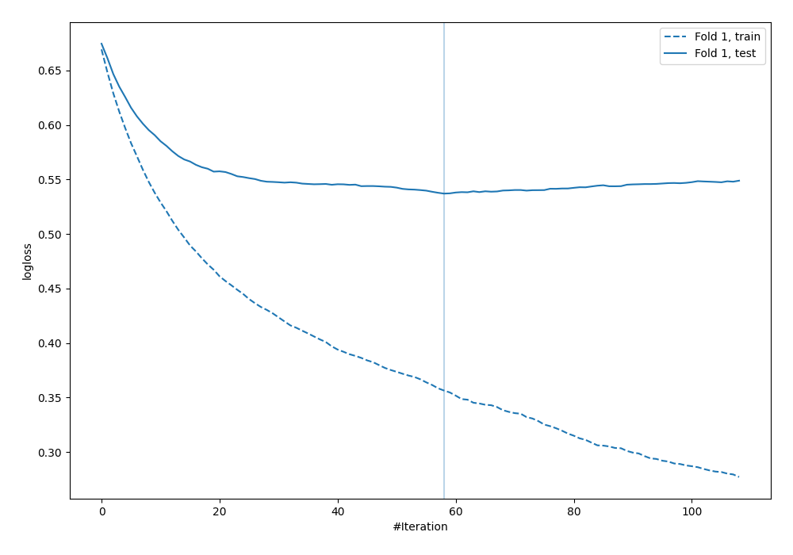

# Summary of 6_Default_Xgboost

[<< Go back](../README.md)

## Extreme Gradient Boosting (Xgboost)
- **n_jobs**: -1
- **objective**: binary:logistic
- **eval_metric**: logloss
- **eta**: 0.075
- **max_depth**: 6
- **min_child_weight**: 1
- **subsample**: 1.0
- **colsample_bytree**: 1.0
- **explain_level**: 0

## Validation
 - **validation_type**: split
 - **train_ratio**: 0.9
 - **shuffle**: True
 - **stratify**: True

## Optimized metric
logloss

## Training time

1.9 seconds

## Metric details
|           |    score |    threshold |
|:----------|---------:|-------------:|
| logloss   | 0.537054 | nan          |
| auc       | 0.709073 | nan          |
| f1        | 0.573066 |   0.216918   |
| accuracy  | 0.704023 |   0.649032   |
| precision | 0.5625   |   0.649032   |
| recall    | 1        |   0.00636832 |
| mcc       | 0.360772 |   0.216918   |

## Confusion matrix (at threshold=0.649032)
|                     |   Predicted as negative |   Predicted as positive |
|:--------------------|------------------------:|------------------------:|
| Labeled as negative |                     236 |                       7 |
| Labeled as positive |                      96 |                       9 |

## Learning curves

[<< Go back](../README.md)
