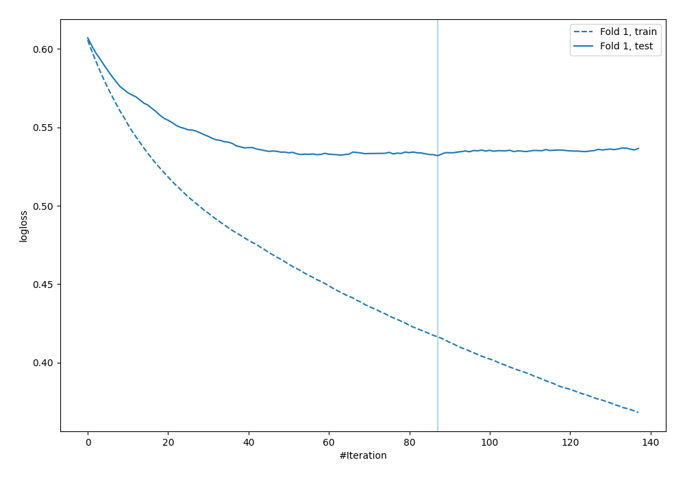

# Summary of 70_LightGBM

[<< Go back](../README.md)

## LightGBM
- **n_jobs**: -1
- **objective**: binary
- **metric**: binary_logloss
- **num_leaves**: 15
- **learning_rate**: 0.05
- **feature_fraction**: 0.8
- **bagging_fraction**: 0.8
- **min_data_in_leaf**: 10
- **explain_level**: 0

## Validation
 - **validation_type**: split
 - **train_ratio**: 0.9
 - **shuffle**: True
 - **stratify**: True

## Optimized metric
logloss

## Training time

1.5 seconds

## Metric details
|           |    score |   threshold |
|:----------|---------:|------------:|
| logloss   | 0.53191  | nan         |
| auc       | 0.716755 | nan         |
| f1        | 0.571429 |   0.273006  |
| accuracy  | 0.706897 |   0.488398  |
| precision | 0.527273 |   0.488398  |
| recall    | 1        |   0.0125261 |
| mcc       | 0.345285 |   0.273006  |

## Confusion matrix (at threshold=0.488398)
|                     |   Predicted as negative |   Predicted as positive |
|:--------------------|------------------------:|------------------------:|
| Labeled as negative |                     217 |                      26 |
| Labeled as positive |                      76 |                      29 |

## Learning curves

[<< Go back](../README.md)
