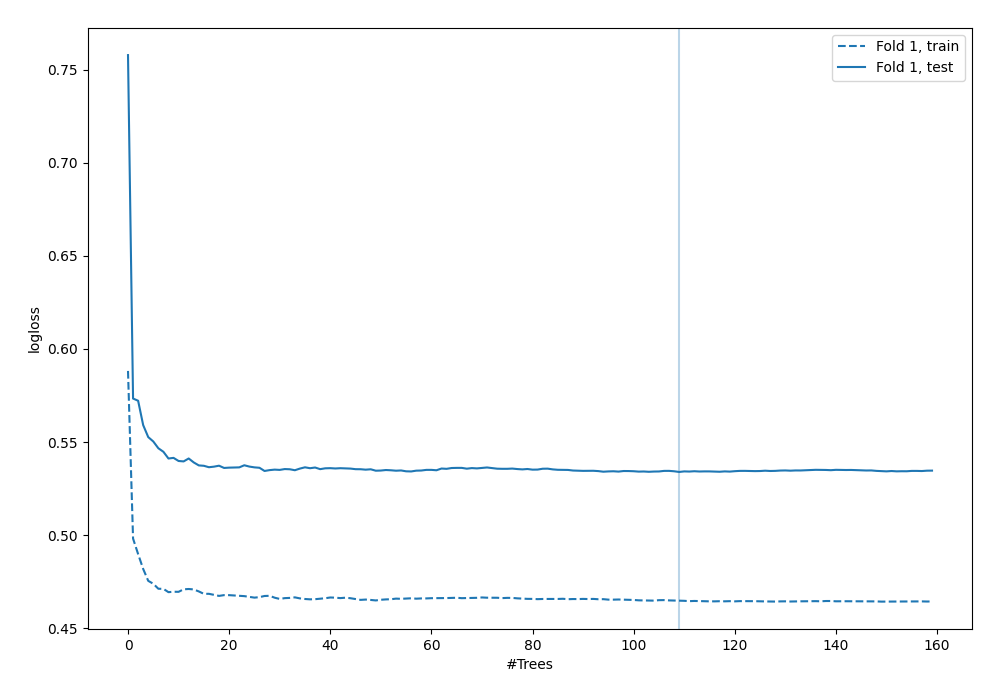

# Summary of 72_RandomForest

[<< Go back](../README.md)

## Random Forest
- **n_jobs**: -1
- **criterion**: gini
- **max_features**: 0.7
- **min_samples_split**: 30
- **max_depth**: 6
- **explain_level**: 0

## Validation
 - **validation_type**: split
 - **train_ratio**: 0.9
 - **shuffle**: True
 - **stratify**: True

## Optimized metric
logloss

## Training time

6.2 seconds

## Metric details
|           |    score |    threshold |
|:----------|---------:|-------------:|
| logloss   | 0.533927 | nan          |
| auc       | 0.700451 | nan          |
| f1        | 0.551929 |   0.292221   |
| accuracy  | 0.70977  |   0.521922   |
| precision | 0.611111 |   0.526781   |
| recall    | 1        |   0.00630879 |
| mcc       | 0.320285 |   0.217186   |

## Confusion matrix (at threshold=0.521922)
|                     |   Predicted as negative |   Predicted as positive |
|:--------------------|------------------------:|------------------------:|
| Labeled as negative |                     234 |                       9 |
| Labeled as positive |                      92 |                      13 |

## Learning curves

[<< Go back](../README.md)
