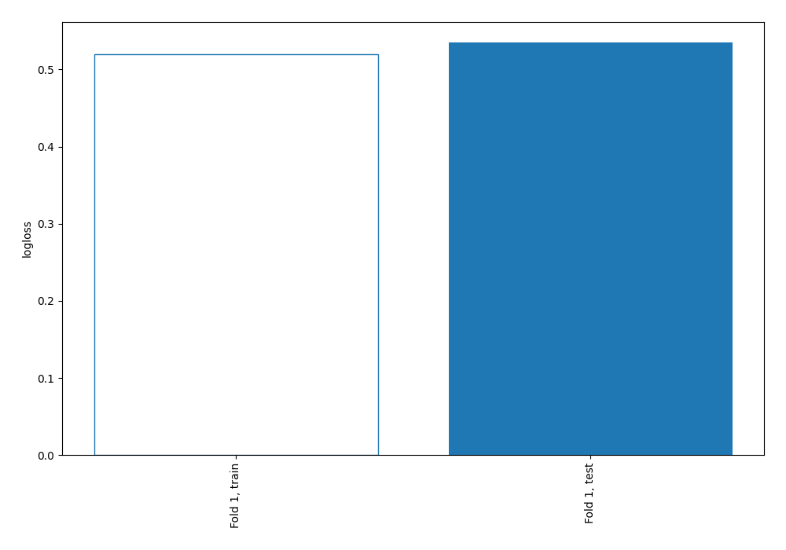

# Summary of 73_DecisionTree

[<< Go back](../README.md)

## Decision Tree
- **n_jobs**: -1
- **criterion**: entropy
- **max_depth**: 4
- **explain_level**: 0

## Validation
 - **validation_type**: split
 - **train_ratio**: 0.9
 - **shuffle**: True
 - **stratify**: True

## Optimized metric
logloss

## Training time

1.1 seconds

## Metric details
|           |    score |   threshold |
|:----------|---------:|------------:|
| logloss   | 0.535091 |  nan        |
| auc       | 0.686714 |  nan        |
| f1        | 0.548303 |    0.242788 |
| accuracy  | 0.706897 |    0.517431 |
| precision | 1        |    0.517431 |
| recall    | 1        |    0        |
| mcc       | 0.329851 |    0.242788 |

## Confusion matrix (at threshold=0.517431)
|                     |   Predicted as negative |   Predicted as positive |
|:--------------------|------------------------:|------------------------:|
| Labeled as negative |                     243 |                       0 |
| Labeled as positive |                     102 |                       3 |

## Learning curves

[<< Go back](../README.md)
