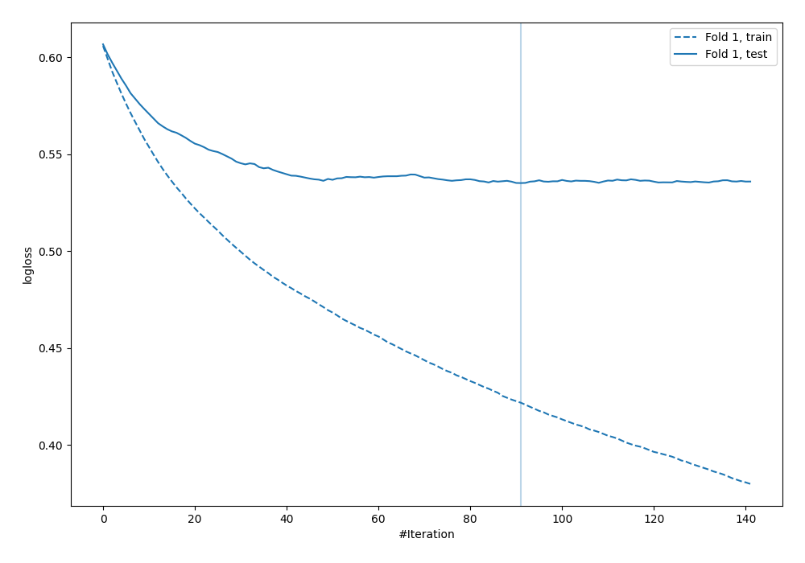

# Summary of 75_LightGBM

[<< Go back](../README.md)

## LightGBM
- **n_jobs**: -1
- **objective**: binary
- **metric**: binary_logloss
- **num_leaves**: 15
- **learning_rate**: 0.05
- **feature_fraction**: 0.8
- **bagging_fraction**: 0.8
- **min_data_in_leaf**: 10
- **explain_level**: 0

## Validation
 - **validation_type**: split
 - **train_ratio**: 0.9
 - **shuffle**: True
 - **stratify**: True

## Optimized metric
logloss

## Training time

0.8 seconds

## Metric details
|           |    score |    threshold |
|:----------|---------:|-------------:|
| logloss   | 0.535121 | nan          |
| auc       | 0.704997 | nan          |
| f1        | 0.567976 |   0.264535   |
| accuracy  | 0.715517 |   0.496459   |
| precision | 0.5625   |   0.496459   |
| recall    | 1        |   0.00995589 |
| mcc       | 0.342404 |   0.256407   |

## Confusion matrix (at threshold=0.496459)
|                     |   Predicted as negative |   Predicted as positive |
|:--------------------|------------------------:|------------------------:|
| Labeled as negative |                     222 |                      21 |
| Labeled as positive |                      78 |                      27 |

## Learning curves

[<< Go back](../README.md)
