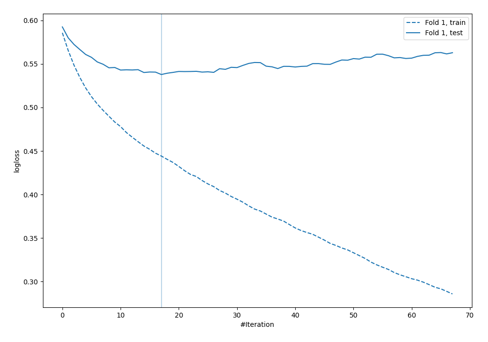

# Summary of 76_LightGBM

[<< Go back](../README.md)

## LightGBM
- **n_jobs**: -1
- **objective**: binary
- **metric**: binary_logloss
- **num_leaves**: 15
- **learning_rate**: 0.2
- **feature_fraction**: 0.8
- **bagging_fraction**: 0.8
- **min_data_in_leaf**: 10
- **explain_level**: 0

## Validation
 - **validation_type**: split
 - **train_ratio**: 0.9
 - **shuffle**: True
 - **stratify**: True

## Optimized metric
logloss

## Training time

0.7 seconds

## Metric details
|           |    score |   threshold |
|:----------|---------:|------------:|
| logloss   | 0.537855 | nan         |
| auc       | 0.708818 | nan         |
| f1        | 0.555556 |   0.297167  |
| accuracy  | 0.701149 |   0.508242  |
| precision | 0.509434 |   0.508242  |
| recall    | 1        |   0.0116698 |
| mcc       | 0.309058 |   0.134729  |

## Confusion matrix (at threshold=0.508242)
|                     |   Predicted as negative |   Predicted as positive |
|:--------------------|------------------------:|------------------------:|
| Labeled as negative |                     217 |                      26 |
| Labeled as positive |                      78 |                      27 |

## Learning curves

[<< Go back](../README.md)
