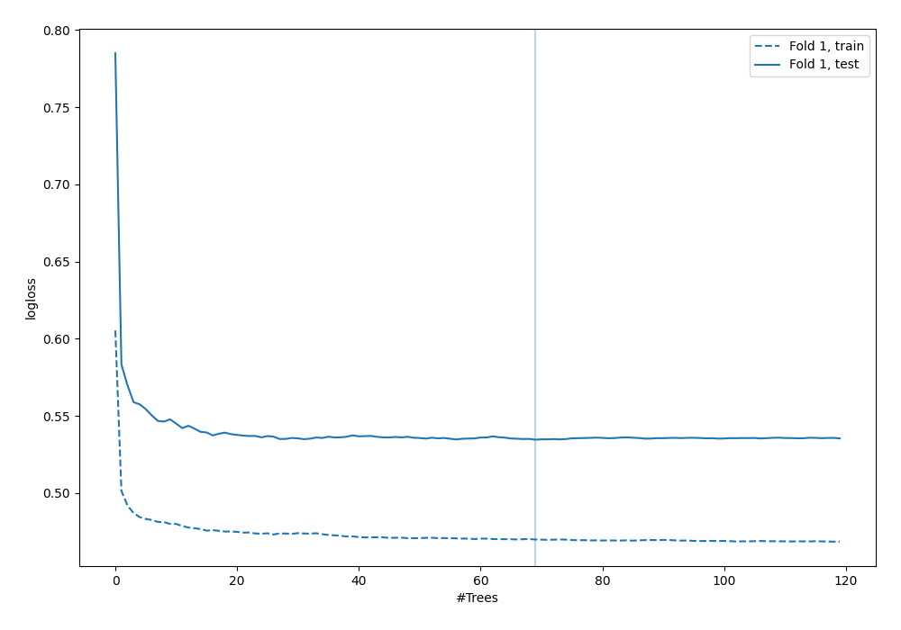

# Summary of 77_RandomForest

[<< Go back](../README.md)

## Random Forest
- **n_jobs**: -1
- **criterion**: gini
- **max_features**: 0.7
- **min_samples_split**: 30
- **max_depth**: 6
- **explain_level**: 0

## Validation
 - **validation_type**: split
 - **train_ratio**: 0.9
 - **shuffle**: True
 - **stratify**: True

## Optimized metric
logloss

## Training time

3.6 seconds

## Metric details
|           |    score |   threshold |
|:----------|---------:|------------:|
| logloss   | 0.534607 | nan         |
| auc       | 0.699784 | nan         |
| f1        | 0.559557 |   0.251749  |
| accuracy  | 0.70977  |   0.508635  |
| precision | 0.583333 |   0.508635  |
| recall    | 1        |   0.0036537 |
| mcc       | 0.337279 |   0.251749  |

## Confusion matrix (at threshold=0.508635)
|                     |   Predicted as negative |   Predicted as positive |
|:--------------------|------------------------:|------------------------:|
| Labeled as negative |                     233 |                      10 |
| Labeled as positive |                      91 |                      14 |

## Learning curves

[<< Go back](../README.md)
