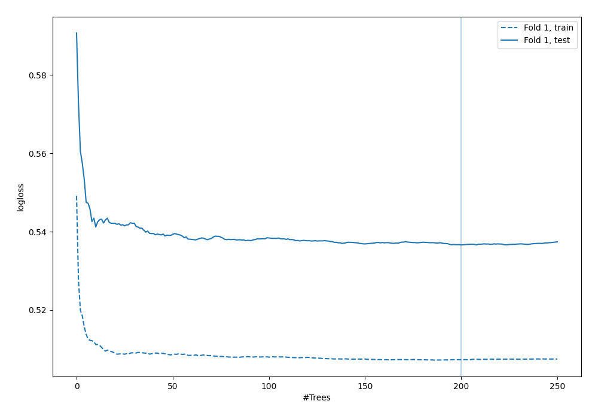

# Summary of 9_Default_RandomForest

[<< Go back](../README.md)

## Random Forest
- **n_jobs**: -1
- **criterion**: gini
- **max_features**: 0.9
- **min_samples_split**: 30
- **max_depth**: 4
- **explain_level**: 0

## Validation
 - **validation_type**: split
 - **train_ratio**: 0.9
 - **shuffle**: True
 - **stratify**: True

## Optimized metric
logloss

## Training time

5.6 seconds

## Metric details
|           |    score |   threshold |
|:----------|---------:|------------:|
| logloss   | 0.5366   | nan         |
| auc       | 0.694297 | nan         |
| f1        | 0.554913 |   0.288442  |
| accuracy  | 0.706897 |   0.47448   |
| precision | 0.542857 |   0.47448   |
| recall    | 1        |   0.0142563 |
| mcc       | 0.326311 |   0.234064  |

## Confusion matrix (at threshold=0.47448)
|                     |   Predicted as negative |   Predicted as positive |
|:--------------------|------------------------:|------------------------:|
| Labeled as negative |                     227 |                      16 |
| Labeled as positive |                      86 |                      19 |

## Learning curves

[<< Go back](../README.md)
