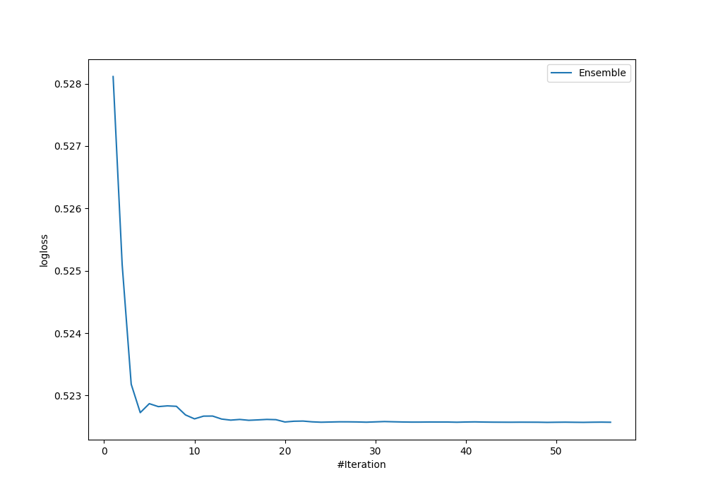

# Summary of Ensemble

[<< Go back](../README.md)

## Ensemble structure
| Model                          |   Weight |
|:-------------------------------|---------:|
| 13_Xgboost                     |        2 |
| 15_Xgboost                     |       10 |
| 21_LightGBM_KMeansFeatures     |       10 |
| 25_LightGBM                    |        2 |
| 3_DecisionTree_KMeansFeatures  |       15 |
| 40_RandomForest_KMeansFeatures |       10 |

## Metric details
|           |    score |   threshold |
|:----------|---------:|------------:|
| logloss   | 0.52257  | nan         |
| auc       | 0.73494  | nan         |
| f1        | 0.570492 |   0.306267  |
| accuracy  | 0.729885 |   0.537857  |
| precision | 0.73913  |   0.537857  |
| recall    | 1        |   0.0111157 |
| mcc       | 0.345288 |   0.270526  |

## Confusion matrix (at threshold=0.537857)
|                     |   Predicted as negative |   Predicted as positive |
|:--------------------|------------------------:|------------------------:|
| Labeled as negative |                     237 |                       6 |
| Labeled as positive |                      88 |                      17 |

## Learning curves

[<< Go back](../README.md)
