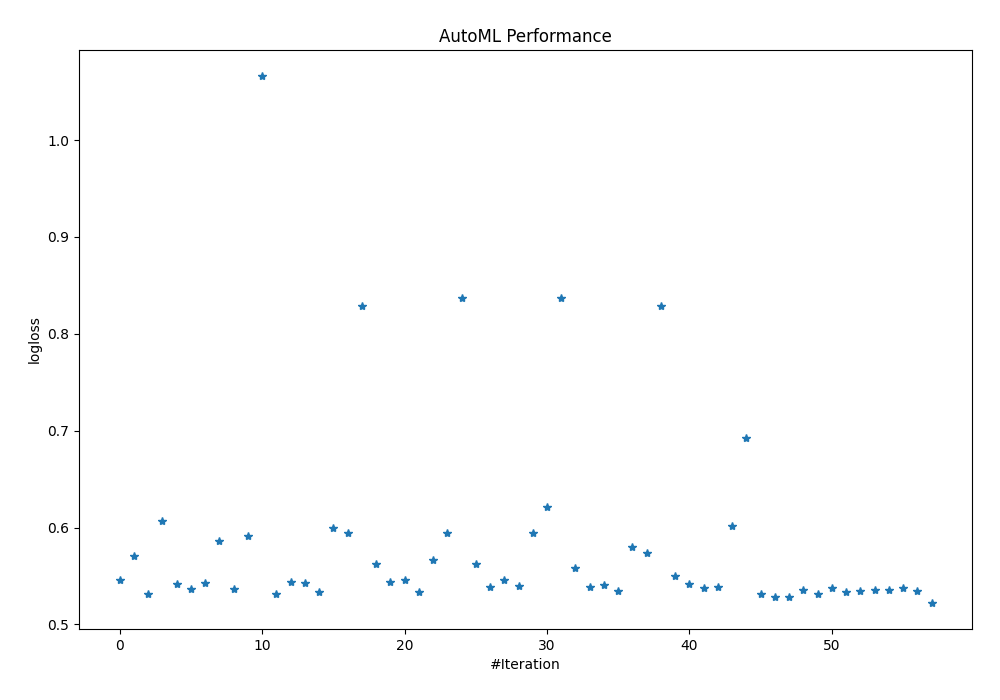
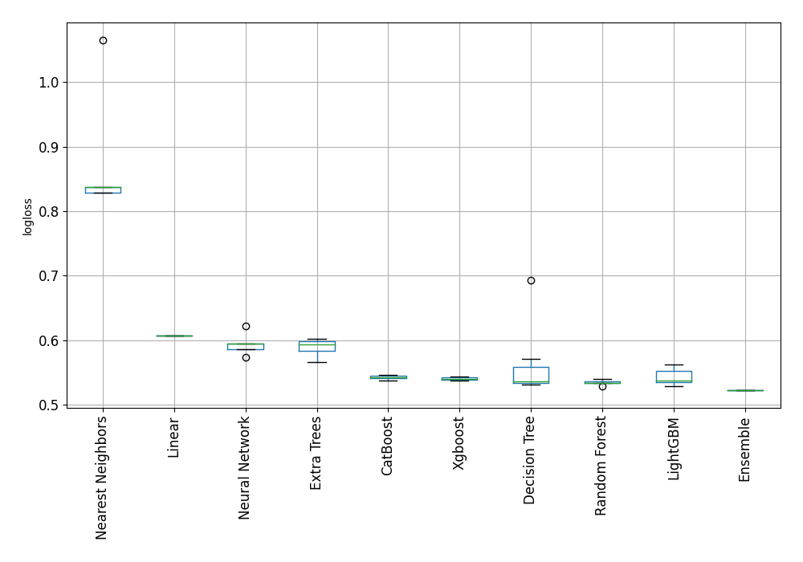

# AutoML Leaderboard

| Best model   | name                                                                                           | model_type        | metric_type   |   metric_value |   train_time |
|:-------------|:-----------------------------------------------------------------------------------------------|:------------------|:--------------|---------------:|-------------:|
|              | [1_DecisionTree](1_DecisionTree/README.md)                                                     | Decision Tree     | logloss       |       0.545555 |         1.68 |
|              | [2_DecisionTree](2_DecisionTree/README.md)                                                     | Decision Tree     | logloss       |       0.570808 |         0.74 |
|              | [3_DecisionTree](3_DecisionTree/README.md)                                                     | Decision Tree     | logloss       |       0.531831 |         0.77 |
|              | [4_Linear](4_Linear/README.md)                                                                 | Linear            | logloss       |       0.60657  |         3.27 |
|              | [5_Default_LightGBM](5_Default_LightGBM/README.md)                                             | LightGBM          | logloss       |       0.541748 |         1.66 |
|              | [6_Default_Xgboost](6_Default_Xgboost/README.md)                                               | Xgboost           | logloss       |       0.537054 |         2.19 |
|              | [7_Default_CatBoost](7_Default_CatBoost/README.md)                                             | CatBoost          | logloss       |       0.54243  |         2.37 |
|              | [8_Default_NeuralNetwork](8_Default_NeuralNetwork/README.md)                                   | Neural Network    | logloss       |       0.585997 |         1.28 |
|              | [9_Default_RandomForest](9_Default_RandomForest/README.md)                                     | Random Forest     | logloss       |       0.5366   |         5.88 |
|              | [10_Default_ExtraTrees](10_Default_ExtraTrees/README.md)                                       | Extra Trees       | logloss       |       0.591541 |         2.2  |
|              | [11_Default_NearestNeighbors](11_Default_NearestNeighbors/README.md)                           | Nearest Neighbors | logloss       |       1.06572  |         0.95 |
|              | [21_LightGBM](21_LightGBM/README.md)                                                           | LightGBM          | logloss       |       0.531905 |         0.96 |
|              | [12_Xgboost](12_Xgboost/README.md)                                                             | Xgboost           | logloss       |       0.543357 |         2.05 |
|              | [30_CatBoost](30_CatBoost/README.md)                                                           | CatBoost          | logloss       |       0.542842 |         3.79 |
|              | [39_RandomForest](39_RandomForest/README.md)                                                   | Random Forest     | logloss       |       0.533646 |         3.05 |
|              | [48_ExtraTrees](48_ExtraTrees/README.md)                                                       | Extra Trees       | logloss       |       0.599645 |         1.41 |
|              | [57_NeuralNetwork](57_NeuralNetwork/README.md)                                                 | Neural Network    | logloss       |       0.594065 |         1.27 |
|              | [66_NearestNeighbors](66_NearestNeighbors/README.md)                                           | Nearest Neighbors | logloss       |       0.82899  |         0.95 |
|              | [22_LightGBM](22_LightGBM/README.md)                                                           | LightGBM          | logloss       |       0.562445 |         1.06 |
|              | [13_Xgboost](13_Xgboost/README.md)                                                             | Xgboost           | logloss       |       0.543732 |         2.25 |
|              | [31_CatBoost](31_CatBoost/README.md)                                                           | CatBoost          | logloss       |       0.546391 |         2.82 |
|              | [40_RandomForest](40_RandomForest/README.md)                                                   | Random Forest     | logloss       |       0.533113 |         3.99 |
|              | [49_ExtraTrees](49_ExtraTrees/README.md)                                                       | Extra Trees       | logloss       |       0.566237 |         1.39 |
|              | [58_NeuralNetwork](58_NeuralNetwork/README.md)                                                 | Neural Network    | logloss       |       0.594152 |         1.32 |
|              | [67_NearestNeighbors](67_NearestNeighbors/README.md)                                           | Nearest Neighbors | logloss       |       0.837011 |         0.88 |
|              | [23_LightGBM](23_LightGBM/README.md)                                                           | LightGBM          | logloss       |       0.56234  |         1.16 |
|              | [14_Xgboost](14_Xgboost/README.md)                                                             | Xgboost           | logloss       |       0.53917  |         1.19 |
|              | [32_CatBoost](32_CatBoost/README.md)                                                           | CatBoost          | logloss       |       0.545522 |         2.24 |
|              | [41_RandomForest](41_RandomForest/README.md)                                                   | Random Forest     | logloss       |       0.539692 |         2.17 |
|              | [50_ExtraTrees](50_ExtraTrees/README.md)                                                       | Extra Trees       | logloss       |       0.594151 |         1.3  |
|              | [59_NeuralNetwork](59_NeuralNetwork/README.md)                                                 | Neural Network    | logloss       |       0.621737 |         0.93 |
|              | [68_NearestNeighbors](68_NearestNeighbors/README.md)                                           | Nearest Neighbors | logloss       |       0.837011 |         0.96 |
|              | [24_LightGBM](24_LightGBM/README.md)                                                           | LightGBM          | logloss       |       0.558356 |         0.89 |
|              | [15_Xgboost](15_Xgboost/README.md)                                                             | Xgboost           | logloss       |       0.538541 |         5.22 |
|              | [33_CatBoost](33_CatBoost/README.md)                                                           | CatBoost          | logloss       |       0.540582 |         2.96 |
|              | [42_RandomForest](42_RandomForest/README.md)                                                   | Random Forest     | logloss       |       0.534153 |         2.64 |
|              | [51_ExtraTrees](51_ExtraTrees/README.md)                                                       | Extra Trees       | logloss       |       0.580226 |         1.68 |
|              | [60_NeuralNetwork](60_NeuralNetwork/README.md)                                                 | Neural Network    | logloss       |       0.5734   |         1.29 |
|              | [69_NearestNeighbors](69_NearestNeighbors/README.md)                                           | Nearest Neighbors | logloss       |       0.82899  |         0.89 |
|              | [25_LightGBM](25_LightGBM/README.md)                                                           | LightGBM          | logloss       |       0.550222 |         0.94 |
|              | [16_Xgboost](16_Xgboost/README.md)                                                             | Xgboost           | logloss       |       0.541818 |         1.41 |
|              | [34_CatBoost](34_CatBoost/README.md)                                                           | CatBoost          | logloss       |       0.537923 |         2.21 |
|              | [43_RandomForest](43_RandomForest/README.md)                                                   | Random Forest     | logloss       |       0.53912  |         7.38 |
|              | [52_ExtraTrees](52_ExtraTrees/README.md)                                                       | Extra Trees       | logloss       |       0.601839 |         2.23 |
|              | [3_DecisionTree_GoldenFeatures](3_DecisionTree_GoldenFeatures/README.md)                       | Decision Tree     | logloss       |       0.692935 |        10.23 |
|              | [3_DecisionTree_KMeansFeatures](3_DecisionTree_KMeansFeatures/README.md)                       | Decision Tree     | logloss       |       0.531618 |         1.62 |
|              | [21_LightGBM_KMeansFeatures](21_LightGBM_KMeansFeatures/README.md)                             | LightGBM          | logloss       |       0.528114 |         1.46 |
|              | [40_RandomForest_KMeansFeatures](40_RandomForest_KMeansFeatures/README.md)                     | Random Forest     | logloss       |       0.528389 |         4.01 |
|              | [21_LightGBM_KMeansFeatures_RandomFeature](21_LightGBM_KMeansFeatures_RandomFeature/README.md) | LightGBM          | logloss       |       0.535879 |        27.76 |
|              | [70_LightGBM](70_LightGBM/README.md)                                                           | LightGBM          | logloss       |       0.53191  |         1.77 |
|              | [71_LightGBM](71_LightGBM/README.md)                                                           | LightGBM          | logloss       |       0.537647 |         1.48 |
|              | [72_RandomForest](72_RandomForest/README.md)                                                   | Random Forest     | logloss       |       0.533927 |         6.49 |
|              | [73_DecisionTree](73_DecisionTree/README.md)                                                   | Decision Tree     | logloss       |       0.535091 |         1.3  |
|              | [74_DecisionTree](74_DecisionTree/README.md)                                                   | Decision Tree     | logloss       |       0.53585  |         0.77 |
|              | [75_LightGBM](75_LightGBM/README.md)                                                           | LightGBM          | logloss       |       0.535121 |         1.07 |
|              | [76_LightGBM](76_LightGBM/README.md)                                                           | LightGBM          | logloss       |       0.537855 |         0.98 |
|              | [77_RandomForest](77_RandomForest/README.md)                                                   | Random Forest     | logloss       |       0.534607 |         3.86 |
| **the best** | [Ensemble](Ensemble/README.md)                                                                 | Ensemble          | logloss       |       0.52257  |        13.43 |

### AutoML Performance

### AutoML Performance Boxplot
